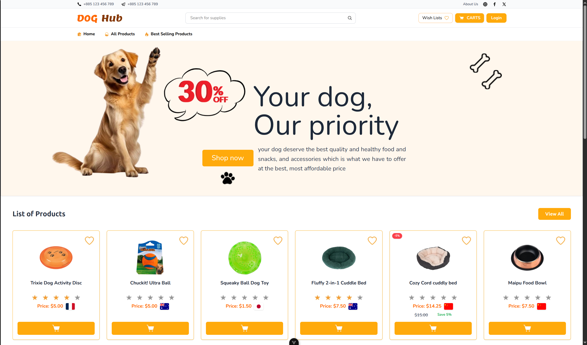
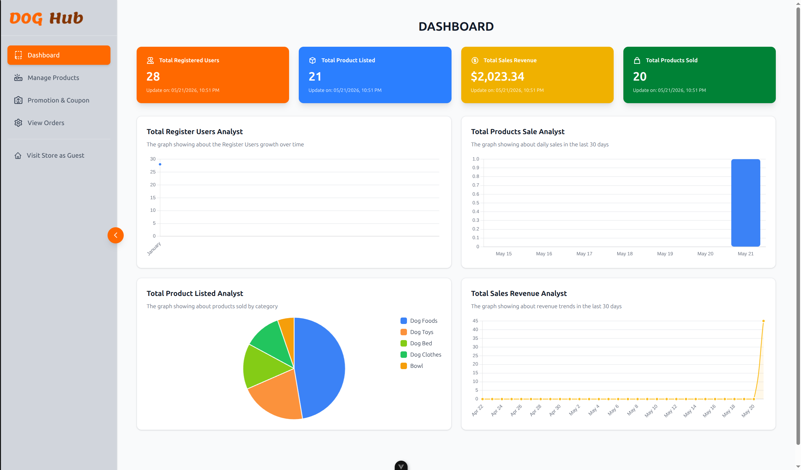

# DogHub Frontend

This is the frontend application for DogHub, a pet marketplace built with Vue 3, Vite, Pinia, and Tailwind CSS.

## Overview

The frontend includes:

- user authentication and profile views
- product browsing, search, and category pages
- shopping cart and wishlist functionality
- checkout flow and order review
- admin dashboard pages for managing products, categories, coupons, and orders
- responsive UI with modern Vue 3 composition API patterns

## Screenshots

### User View



### Admin Dashboard



## Prerequisites

- Node.js 20.x or later
- npm 10.x or later

## Setup

Install dependencies:

```sh
npm install
```

Run the app in development mode:

```sh
npm run dev
```

Open the URL shown in the terminal (typically `http://localhost:5173`).

## Build

Create a production build:

```sh
npm run build
```

Preview the production build locally:

```sh
npm run preview
```

## Scripts

- `npm run dev` — start the local development server
- `npm run build` — build the production bundle
- `npm run preview` — preview the production build
- `npm run test:unit` — run unit tests with Vitest
- `npm run test:e2e` — run Playwright end-to-end tests
- `npm run lint` — run ESLint and automatically fix issues
- `npm run format` — format code with Prettier

## Testing

Run unit tests:

```sh
npm run test:unit
```

Run end-to-end tests:

```sh
npx playwright install
npm run test:e2e
```

## Notes

- The backend API should be running separately in the `Backend/` folder.
- Screenshots are stored in `src/assets/Readme/`.
- If you use VS Code, install the Vue extension and enable Volar for best TypeScript support.
